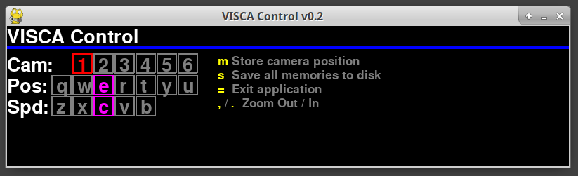

# viscacontrol
A simple Python application for controlling Cisco TelePresence PrecisionHD Cameras.
Developed against the PHD1080P12XS2 camera



## Intro

The Cisco 1080P12XS2 cameras offer a great amount of quality and power at an affordable 
price on the surplus market. They were designed to operate with Cisco conference solutions,
mainly a processor Cisco (and formerly Tandberg) calls the Codec. The control protocol 
is public, and this is a partial implementation of that.

The protocol is similar to the Sony VISCA cameras, except those units allow for storage 
of PTZ positions on the cameras. The lack of this feature on the Cisco firmware means 
that the Sony controllers such as the BR-300 will not function well with the Cisco cameras. 
I tried.

- Camera good points and bad:
  - Good
    -  1080p60 via HDMI, 1080p30 via HD-SDI
    -  Good PTZ range
    -  Units can daisy chain RS232 control unit to unit
    -  Quality optics (might be Sony guts, not sure)
    -  Standard tripod mount
  - Not so good
    - Soft feel coating gets sticky with age
      - Baby powder will remove stickyness
    - Ethernet port only for firmware upgrades
      - Couldn't seem to do VISCA over TCP, portscanned it
      - This would be epic win, could ditch ethernet to serial bridge
    - Black plastic cover often missing from units on surplus market
      - Working on 3d printable replacement
    - Daisy chain port is RJ11
      - Have to make custom cables (see below)

## VISCA Control - About the software

Python 2.7 / PyGame UI for controlling the cameras. My main feature wants was 
to be able to remotely move cameras and save positions for instant recall. My
use is recording and streaming talks at a few events. Years ago I built a 
similar setup that used Polycom cameras that were composite output, AMX NetLinx
controller, Extron Crosspoint matrix switch and a Debian PC doing capture. It
was great, but low definition and the camera video had to be time-base corrected
to cleanly switch.

Now I will use OBS, Magewell SDI capture and Cisco cameras.

## Host to camera is via Ethernet to Serial

This software was built against using a Lantronix MSS ethernet to serial converter.
Digi Portserver, Blackbox version of the Lantronix or other devices could be used.
I haven't tried directly attaching the camera to host with a USB to Serial since
in my case ethernet is better for stage to front-of-house control.


## Current software limitations

#### PTZ doesn't include speed

The Cisco all-in-one command to move camera doesn't include speed, and I didn't
implement saving speed with movement presets. The main thing for movement
for me is those slow sweeping audience pans that include zoom like on Arsino Hall.
Can manually make this happen.

#### Joystick support

I have joystick support written but I suck at Python, it jams up keyboard control
when it's disabled so I pulled it out. Need to allow command line configuration of
stuff like joystick, IP Address and position file but that is for the future.

#### Not much support for camera image features

I didn't get around to things like white balance and backlight compensation. Haven't
played with them, maybe in the future. Same with focus.

## Hardware setup and notes

I used Cisco's documentation and an Arduino project as a reference. It might be worth it
in the future to contribute some of my ideas to the Arduino project and make a custom
PCB with those switcher style buttons. We will see.

The Cisco reference has pinouts for cables and full protocol documentation. It's really good.
[Cisco reference PDF](https://www.cisco.com/c/dam/en/us/td/docs/telepresence/endpoint/camera/precisionhd/user_guide/precisionhd_1080p-720p_camera_user_guide.pdf)

Another project that is stand alone, easy list of commands used. Might be worth contributing to this in the future to
make stand-alone version of what I am after.
[Arduino Project with good info](https://github.com/foxworth42/arduino-VISCA-controller/blob/master/visca_controller/src/visca_controller.h)

Lantronix MSS Serial Server default priv password = system

### 1st cam to 2nd cam cable pinout
```

RJ11 to RJ45 chain cable, gold pins upwards and facing you on plastic RJ45/RJ11. Pin #1 is left
RJ45 Standard cat5:  WhiteOrange Orange WhiteGreen Blue WhiteBlue Green WhiteBrown Brown
RJ11 6 position   :  Orange WhiteOrange WhiteGreen Green WhiteBrown NotConnected

```

Will post DB25 to RJ45 adapter/pinout soon

## Running the script

- Configure serial server for 9600,8,n,1
- Edit the target IP and port number for the serial server you are using
- python 2.7, pygame are required

